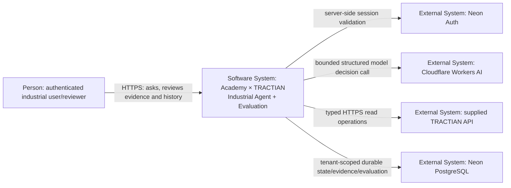
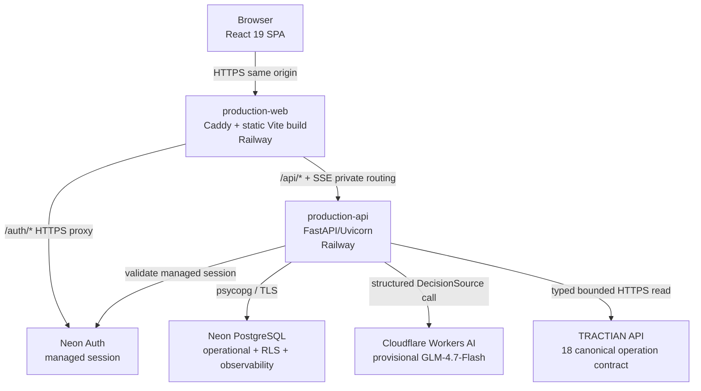

# Academy × TRACTIAN — Architecture

**Status:** ACTIVE canonical architecture  
**Last verified:** 2026-09-06 BRT  
**Promoted backend/runtime:** `082d6f115c070fdc898df749b4b3018efd9ceeab`  
**Current hosted frontend UX:** `2ca6215ccc07664a9551e8363e438f0930a4d995`  
**Current hosted supplied API:** `47561c1175181b508139e23e6e39b555c1347d57`  
**Validated PR #196 head:** `d7e941b1e0ee380f3cca43816521c88eddc20e9c`  
**Main integration merge:** `9fbfbe0c5b5b80dc23941ac2850125834641e32b`

This document describes the architecture that is **actually promoted/hosted now**, then separates future hardening from current claims. Repository integration and hosted component identities are deliberately distinct; the merge into `main` is not treated as an automatic redeploy.

The diagrams use a C4-inspired zoom: system context first, then containers, then the dynamic investigation path. Detail is added only where it changes responsibilities or trust boundaries.

## 1. System context



**Scope:** Academy × TRACTIAN product.  
**External dependencies:** identity, model provider, TRACTIAN API and hosted PostgreSQL.  
**Key boundary:** browser input is never authority for tenant/role/permissions.

## 2. Production containers



| Container | Responsibility | Technology/current state |
|---|---|---|
| browser SPA | user interaction + safe visualization | React, TypeScript, TanStack Query, React Flow/ECharts |
| `production-web` | public HTTPS origin/static serving/proxy | Caddy on Railway |
| `production-api` | auth context, runtime, tools, policy, evaluation, REST/SSE | Python 3.11+, FastAPI/Uvicorn |
| Neon Auth | managed session lifecycle | server-validated managed auth |
| Neon PostgreSQL | durable operational truth + tenant RLS + safe observability/evals | PostgreSQL + psycopg |
| Cloudflare Workers AI | provisional Release 0 decisions | `@cf/zai-org/glm-4.7-flash` |
| supplied TRACTIAN API | canonical industrial evidence | 13 reads live; 5 actions represented but external execution disabled |

## 3. Dynamic investigation flow

```mermaid
sequenceDiagram
    actor User
    participant Web as React/Caddy
    participant API as FastAPI
    participant DB as Neon PostgreSQL
    participant Model as Cloudflare
    participant Tool as HarnessRunner
    participant T as TRACTIAN
    participant Eval as ProductionEvaluator

    User->>Web: submit industrial request
    Web->>API: POST /api/runs (managed session)
    API->>API: derive server-owned tenant/runtime context
    API->>DB: persist run ownership/state
    API->>Model: bounded DecisionSource request
    Model-->>API: typed decision/tool proposal
    API->>Tool: validate + execute canonical read
    Tool->>T: bounded typed HTTPS request
    T-->>Tool: evidence response
    Tool-->>API: normalized observation/evidence
    API->>Model: next bounded decision when needed
    Model-->>API: FINAL / CLARIFY / ABSTAIN / ESCALATE
    API->>DB: persist terminal trace/evidence
    API->>Eval: post-runtime deterministic evaluation
    Eval-->>DB: safe evaluation projection
    API-->>Web: authenticated SSE + durable catch-up
    Web-->>User: Results first; deeper evidence/runtime/engineering on demand
```

The evaluator is post-runtime. Evaluator-private truth is not supplied to the model.

## 4. Runtime responsibility boundaries

```text
DecisionSource
→ proposes next typed decision

AgentController
→ owns bounded control flow

HarnessRunner
→ exclusive canonical tool execution boundary

B1 schema/argument validation
B2 permission/resource/policy
B3 evidence/authorization boundary where applicable

ProductionTractianTransport
→ owns real network contract, server credentials, timeout/size/redirect rules
```

A model cannot directly perform network I/O or grant itself permissions.

## 5. Identity and tenant boundary

```text
managed HttpOnly browser session
→ server-side Neon session validation
→ authenticated user + active/personal organization scope
→ AuthenticatedRuntimeContext
→ transaction-local PostgreSQL organization scope
→ RLS
```

Rules:

- browser organization/role/permission headers are not authority;
- missing, invalid, mismatched or unavailable sessions fail closed;
- default runtime permissions are server-defined;
- RLS is an independent database boundary;
- same-origin SSE carries the authenticated browser session naturally.

The hosted Release 0 two-user campaign passed cross-tenant REST/SSE negative cases for its tested scope.

## 6. Evidence and realtime architecture

```text
canonical runtime transition
→ sanitized immutable event row
→ authoritative (run_id, sequence) cursor
→ PostgreSQL commit
→ LISTEN/NOTIFY wake-up
→ bounded durable catch-up reads
→ authenticated SSE
→ idempotent React state
```

PostgreSQL rows/cursors are truth. `LISTEN/NOTIFY` is only wake-up; missed notifications cannot become missing authoritative state.

Browser projections exclude raw secrets, private action custody, evaluator-private material and hidden chain-of-thought.

## 7. UX architecture — progressive depth

The current hosted frontend intentionally separates user and engineering needs:

```text
01 Results
   answer, next step, onboarding, guided entry, live stages
        ↓ when needed
02 Evidence
   canonical safe trail + persisted terminal/evidence coverage
        ↓ when needed
03 Investigation
   history, execution state, metrics, Trace Graph, action proposal/control
        ↓ when needed
04 Engineering
   capabilities, architecture, evaluator, analytics, controlled research collectors
```

Every layer operates on the same selected persisted run. New runs and history selection return to Results first.

Accessibility includes tab/tabpanel semantics and keyboard Arrow Left/Right, Home and End navigation.

## 8. Capability and action boundary

Canonical registry invariant:

```text
18 operations total
13 READ  → LIVE_READ in Release 0 when provider + TRACTIAN path are available
5 ACTION → PROPOSAL_ONLY in Release 0
```

The codebase contains a stronger governed action architecture (custody, explicit confirmation, idempotency, leases/fencing, uncertainty semantics), but **production Release 0 authorization is deny-all for consequential external execution**.

Proposal visibility is not execution authority.

## 9. Provider boundary

Two states deliberately coexist:

- **Release 0 serving:** Cloudflare GLM-4.7-Flash is provisional and allowed for the promoted read-only path.
- **Final provider selection:** frozen Provider Tournament v3 remains `NO_SELECTION` pending 170 preregistered attempts.

No hidden fallback may silently replace provider/model/route or cross into paid operation.

## 10. Release/deployment identity

Repository and hosted identities are tracked independently:

- promoted backend/runtime: `082d6f115c070fdc898df749b4b3018efd9ceeab`;
- current hosted frontend UX: `2ca6215ccc07664a9551e8363e438f0930a4d995`;
- current hosted supplied API: `47561c1175181b508139e23e6e39b555c1347d57`;
- validated source head merged from PR #196: `d7e941b1e0ee380f3cca43816521c88eddc20e9c`;
- repository integration commit on `main`: `9fbfbe0c5b5b80dc23941ac2850125834641e32b`.

The backend production artifact binds configured release SHA to baked artifact identity and Railway runtime identity before serving a production claim. A frontend or supplied-API deployment may advance independently; neither a source merge nor a docs-only commit implies a new backend runtime promotion.

## 11. Evaluation architecture

Primary layer:

```text
RunTrace
→ deterministic structural/safety/trajectory checks
→ safe evaluation projection
→ Engineering/Eval surfaces
```

Human-dependent semantic calibration remains separate and not gating until real blinded labels establish reliability.

Operational-value collection is also a controlled study. Its dataset must not be polluted with casual product feedback.

## 12. Technology decisions currently promoted

| Area | State |
|---|---|
| custom `AgentController` | promoted baseline |
| typed `HarnessRunner` / `ToolSpec` | hard execution boundary |
| FastAPI + REST/SSE | promoted |
| PostgreSQL serving truth | promoted |
| PostgreSQL LISTEN/NOTIFY wake-up | promoted; rows remain truth |
| React/Vite/Caddy | promoted frontend path |
| Railway frontend/backend | hosted Release 0 path |
| Neon PostgreSQL | hosted Release 0 path |
| Neon managed auth | hosted Release 0 path |
| Cloudflare GLM-4.7-Flash | provisional Release 0 only |
| DuckDB | dev/benchmark compatibility only |
| RAG/vector DB | NO_CHANGE |
| persistent memory | NO_CHANGE |
| multi-agent | NO_CHANGE |
| MCP | NO_CHANGE unless interoperability gap appears |
| LangGraph migration | NO_CHANGE unless challenger wins |
| Redis/Kafka/Kubernetes | NO_CHANGE unless measured need appears |
| adaptive stopping/routing | not promoted; evaluator/challenger scope only |

## 13. Trust boundaries and active risks

See [`SECURITY-MODEL.md`](SECURITY-MODEL.md) for the active OWASP-style threat model. Architecturally critical boundaries are:

1. browser ↔ same-origin frontend/API;
2. API ↔ managed identity;
3. runtime/model ↔ deterministic policy/tool authority;
4. API ↔ TRACTIAN credentials/network;
5. application ↔ tenant-scoped PostgreSQL/RLS;
6. runtime ↔ post-runtime evaluator;
7. safe observability ↔ private/raw state;
8. project free-tier operation ↔ paid-spillover boundary.

## 14. Current non-claims

Do not claim final provider superiority, OAuth/OIDC/enterprise SSO, consequential external action readiness, full SECURITY-V1, final production capacity/SLO/HA/RTO/RPO, human semantic calibration, observed time savings or adaptive-policy superiority until the corresponding evidence exists.

## 15. Architecture change gate

A material architecture change requires:

```text
measured requirement/gap
→ USD0 + safety eligibility
→ simple current baseline
→ systematic research
→ credible alternatives
→ metrics/hard gates
→ controlled comparison
→ failure/production-fit analysis
→ decision + reversal trigger
→ ADR/registry + regression + docs sync
```

Architecture is not improved by increasing component count.