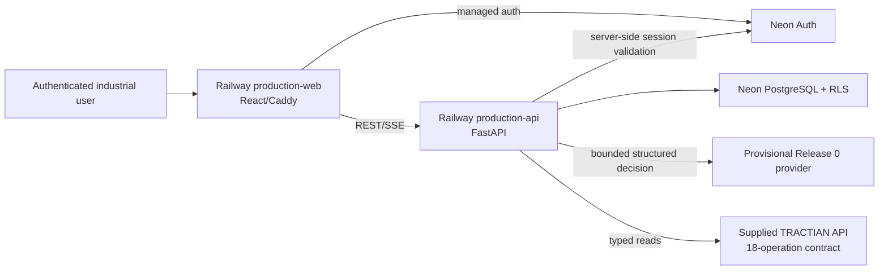

# Academy × TRACTIAN — Architecture

**Status:** ACTIVE canonical architecture  
**Last verified:** 2026-09-08 BRT  
**Repository `main` HEAD:** `4364364266c6a88d4affd85cb3a734c774cd42c8`  
**Provider research status:** [`PROVIDER-QUALIFICATION-STATUS-2026-09-08.md`](PROVIDER-QUALIFICATION-STATUS-2026-09-08.md)

This document separates the **promoted hosted architecture** from the **provider-selection challenger architecture**. Research commits do not automatically change production.

## 1. Promoted system context



Browser input and model output are never authority for tenant, role or permission.

## 2. Promoted runtime path

```text
authenticated request
→ server-owned tenant/runtime context
→ provisional Release 0 DecisionSource
→ AgentController
→ HarnessRunner + canonical ToolSpec
→ deterministic argument/policy validation
→ typed ProductionTractianTransport
→ normalized evidence + RunTrace
→ terminal + response_mode
→ deterministic post-runtime evaluation
→ PostgreSQL durable projection
→ authenticated REST/SSE
→ task-driven UI
```

The model does not directly execute network calls. `HarnessRunner` remains the canonical tool boundary.

## 3. Release 0 behavior

Promoted behavior includes:

- grounded identity/company/fleet discovery;
- human-readable asset labels resolved against authorized observations;
- no unnecessary request for discoverable internal IDs;
- condition evidence before diagnostic conclusions where required;
- explicit data-quality evidence for data-quality questions;
- `response_mode = complete | partial | inconclusive | conflict | unavailable`;
- safe fail-closed behavior for missing authorized resources;
- durable evidence/provenance/evaluation/history;
- consequential external action execution disabled.

Same-name RMS/spectrum calls may represent asset→point drill-down. Redundancy decisions must compare normalized arguments/resource/evidence contribution.

## 4. IAM / tenant boundary

```text
managed HttpOnly browser session
→ server-side Neon validation
→ AuthenticatedRuntimeContext
→ transaction-scoped organization context
→ PostgreSQL RLS
```

Current read-burst resilience preserves a bounded validated-context cache for GET/HEAD while non-read requests validate fresh. Raw cookies are not the cache payload or browser authority; expired state is not served stale-on-error.

## 5. Realtime / persistence

```text
runtime transition
→ sanitized immutable row / durable run state
→ PostgreSQL commit + authoritative sequence/cursor
→ LISTEN/NOTIFY wake-up
→ durable catch-up
→ authenticated SSE
→ idempotent frontend projection
```

PostgreSQL state/cursors are truth; notification delivery is only a wake-up mechanism.

## 6. Production capability boundary

```text
18 canonical operations
13 READ  → Release 0 typed read surface
5 ACTION → contract/proposal surface; external execution disabled
```

The repository contains stronger governed-action machinery, but it is not a claim that production currently executes consequential TRACTIAN actions.

## 7. Provider boundary — current promoted state

The production provider remains **provisional**. The 2026-09-08 provider research did not mutate `production-api` or `production-web` and did not authorize a new provider.

A provider change is a separate promotion event requiring provider qualification plus Academy live E2E.

## 8. Provider challenger architecture

The provider-selection research reuses the production decision request/tool registry but runs outside the production-serving authority boundary:

```text
frozen 17×5 evaluation population
→ candidate serving configuration
→ structured decision generation
→ ProviderDecisionPayload validation
→ canonical tool/argument/rubric adjudication
→ hard-gate/reliability metrics
→ PROMOTE candidate | NO_SELECTION
```

Hard gates are not relaxed because a challenger is otherwise attractive.

### Groq result

Groq `openai/gpt-oss-120b` completed a full 85/85 single-provider qualification and returned **`NO_SELECTION`**:

- 81.18% rubric pass;
- 82.35% reliability;
- 9 contract failures;
- 64.71% unit repeat stability.

This is evidence of a structured decision/terminal stability gap, not permission to add repair or hide failures.

## 9. Current causal challenger design

The next research layer tests whether failures arise from output budget, best-effort schema conformance or reasoning effort.

Current baseline/diagnostic configurations:

```text
B0 best-effort / medium / 512
B1 best-effort / medium / 2048
B2 best-effort / low / 2048
```

Evidence already shows that an invalid `ProviderDecisionPayload` can occur with HTTP 200, `finish_reason=stop`, valid JSON and 2048 available tokens. Therefore token budget alone is not the structural fix.

## 10. Proposed strict-output challenger

If causal evidence and provider eligibility support it, derive constrained output variants from the existing canonical contracts:

```text
anyOf
├── TOOL::<each canonical operation>
├── FINAL
├── CLARIFY
├── ESCALATE
└── ABSTAIN
```

Rules:

- closed objects / `additionalProperties=false`;
- tool name fixed by variant;
- arguments generated from canonical ToolSpecs/OpenAPI;
- terminal variants expose only legal fields;
- `ProviderDecisionPayload` remains a second deterministic validator;
- argument validation, policy, tenant scope and action safety remain deterministic.

This is **not** a migration to provider-native tool execution.

The supplied `ActionRequest` component must be recovered exactly before strict action variants are complete; it must not be invented.

## 11. Experiment infrastructure boundary

Provider research currently uses disposable Railway QA execution, not production serving. Account service capacity is constrained to the current five-service envelope; attempts to provision a separate sixth experiment service failed.

The shared QA slot has experienced overlapping experiment deployments, so contaminated partial matrices are discarded rather than combined. Provider admission/rate behavior is measured separately from model quality before re-freezing long campaigns.

## 12. Evaluation architecture

```text
RunTrace / decision observation
→ deterministic structural/safety/trajectory checks
→ quality/stability metrics
→ safe result projection
```

Structural truth remains deterministic. Semantic judges remain non-gating until calibrated with real blinded human labels.

## 13. Technology decisions currently promoted

| Area | State |
|---|---|
| custom `AgentController` | promoted baseline |
| `HarnessRunner` + canonical ToolSpec | hard execution boundary |
| FastAPI + REST/SSE | promoted |
| Neon PostgreSQL/RLS | promoted |
| React/Vite/Caddy | promoted task-driven frontend |
| Railway hosting | promoted Release 0 |
| production provider | provisional; unchanged by 2026-09-08 research |
| Groq GPT-OSS-120B | researched; 85/85 `NO_SELECTION` |
| strict Groq schema | challenger design; not promoted |
| LangGraph/multi-agent/RAG/MCP | no change without measured win |
| Redis/Kafka/Kubernetes | no change without measured need |

## 14. Non-claims

Do not claim final provider superiority, Groq production use, successful strict-mode qualification, consequential action readiness, final HA/SLO/RTO/RPO, human semantic calibration, time savings or unrelated framework superiority until corresponding evidence exists.
