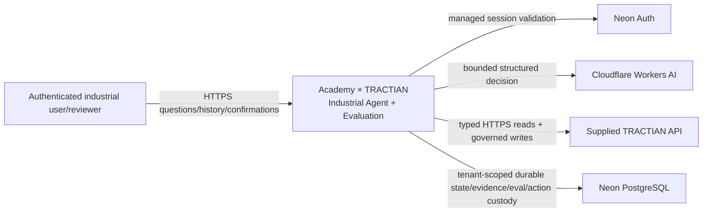
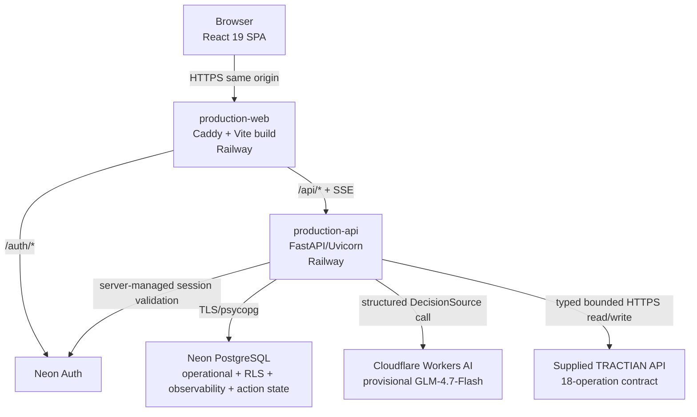

# Academy × TRACTIAN — Architecture

**Status:** ACTIVE canonical architecture  
**Last verified:** 2026-09-07 BRT  
**Current merged backend/runtime source:** `3545d75c00ca30419e0f47e8b1950aa50cbbf462`  
**Current hosted frontend UX:** `1bc124a8d4dbd029178ff8129b25452129445de7`  
**Current hosted supplied API:** `47561c1175181b508139e23e6e39b555c1347d57`

This document describes the architecture actually promoted or currently being closed as an explicit production gate. Repository/source identity and hosted component identities are deliberately separate; a source merge or docs commit is not automatic proof of runtime promotion.

## 1. System context



Key boundary: browser input and model output are never authority for tenant, role, permissions, resource ownership, idempotency, kill-switch state or vendor actor identity.

## 2. Production containers



| Container | Responsibility | Current state |
|---|---|---|
| browser SPA | task-driven user interaction + safe visualization + exact confirmation UI | Home / Analyses / Technical; contextual result/evidence/action state |
| `production-web` | public HTTPS origin/static serving/proxy | Caddy on Railway, `1bc124a...` |
| `production-api` | auth context, runtime, tools, policy, action custody/execution, evaluation, REST/SSE | current source `3545d75c...` |
| Neon Auth | managed session lifecycle | server-validated, bounded read-burst coalescing |
| Neon PostgreSQL | durable operational truth + tenant RLS + observability/evals/action state | PostgreSQL + psycopg |
| Cloudflare Workers AI | provisional Release 0 decisions | `@cf/zai-org/glm-4.7-flash` |
| supplied TRACTIAN API | canonical industrial evidence + consequential action endpoints | 13 reads; 5 governed actions; complete 5/5 action acceptance not yet proven |

## 3. Dynamic read investigation flow

```mermaid
sequenceDiagram
    actor User
    participant Web as React/Caddy
    participant API as FastAPI
    participant Auth as Neon Auth
    participant DB as Neon PostgreSQL
    participant Model as Cloudflare
    participant Tool as HarnessRunner
    participant T as TRACTIAN
    participant Eval as ProductionEvaluator

    User->>Web: submit equipment question
    Web->>API: POST /api/runs (managed session)
    API->>Auth: fresh session validation for non-read request
    API->>API: derive server-owned tenant/runtime context
    API->>DB: persist run ownership/state
    API->>Model: bounded structured decision request
    Model-->>API: typed decision/tool proposal
    API->>Tool: validate + execute canonical read
    Tool->>T: typed HTTPS request
    T-->>Tool: evidence response
    Tool-->>API: normalized observation/evidence
    API->>Model: next bounded decision when needed
    Model-->>API: terminal decision + response_mode
    API->>DB: persist terminal trace/evidence
    API->>Eval: deterministic post-runtime evaluation
    Eval-->>DB: safe evaluation projection
    API-->>Web: authenticated SSE + durable catch-up
    Web-->>User: result first; Analyses/Technical on demand
```

The evaluator is post-runtime. Evaluator-private truth is not supplied to the model.

## 4. Governed consequential action flow

Actions are a separate high-consequence path. Proposal is not execution.

```mermaid
sequenceDiagram
    actor User
    participant API as Product API
    participant Grant as Server-owned authorization
    participant Custody as PostgreSQL custody/idempotency/lease
    participant Tool as Canonical action runner
    participant Actor as Server-owned vendor actor resolver
    participant T as TRACTIAN

    API->>Grant: authorize local requester/company/resource/permission
    API->>Custody: custody exact proposal + fingerprint
    API-->>User: show safe action summary
    User->>API: confirm existing action id
    API->>Grant: fresh tenant-aware authorization
    API->>Custody: acquire idempotency + execution lease
    API->>Actor: resolve company + required permission
    Actor-->>API: one server-owned TRACTIAN actor
    API->>Tool: prepare exact confirmed action
    Tool->>T: one typed governed write
    T-->>Tool: explicit upstream response
    Tool->>Custody: ACCEPTED / NOT_ACCEPTED / UNCERTAIN / BLOCKED
```

Current implementation proves custody, exact confirmation, deterministic authorization, idempotency, lease/fencing and uncertainty semantics. The current unresolved integration gap is the final **vendor actor identity mapping**: the supplied TRACTIAN runtime has distinct actors for low-impact vs high-impact/escalation permissions in the company scope tested, while the existing execution binding forwards the local requester ID as `x-user-id`.

Therefore the target vendor-bound invariant is:

```text
(company_id, canonical_required_permission)
→ exactly one server-owned upstream TRACTIAN actor
```

The local authenticated user remains the authority/audit principal. The vendor actor is not a privilege grant and may never be browser/model controlled.

The corrective actor-routing implementation is in progress and is not yet production-proven.

## 5. V13 Release 0 decision layer

The current read-serving provider wrapper remains intentionally layered so each production fix stays narrow and testable:

```text
base Release 0 provider contract
→ V10: nested ID grounding + condition-evidence/stopping constraints
→ V11: response_mode epistemic semantics
→ V12: explicit human asset labels, bilateral comparisons, data-quality requirements
→ V13: initial identity grounding + completed single-asset quality suppression
```

`remote_server.py` serves `build_release_provider_decision_source_factory_v13` for agent decisions.

### V11 response semantics

```text
complete      all material requested parts supported
partial       useful supported answer + material probabilistic/incomplete part
inconclusive no reliable directional answer after inspecting relevant evidence
conflict      material observations contradict
unavailable   required authorized evidence could not be obtained
```

### V12/V13 explicit-asset grounding

For investigative requests with labels like `R310`:

```text
label in user request
→ get_current_user
→ structured company_id
→ list_assets_by_company
→ structured authorized asset IDs
→ map human label to fleet resource
→ constrain subsequent tool schemas to observed IDs
```

If the label is absent, the tool surface closes and the terminal must report bounded unavailability. The model may not expand itself to another tenant/company.

For a multi-asset comparison, the runtime requires condition evidence for every requested asset present in the authorized fleet before a comparative conclusion.

### Condition and data-quality gates

- diagnostic questions require condition evidence (`get_analysis`, `get_rms`, `get_spectrum`) before terminal where required;
- baseline/data quality do not substitute for condition evidence;
- explicit data-quality questions require `get_data_quality`;
- completed single-asset `get_data_quality` is removed from the visible surface;
- `get_asset` is suppressed after fleet listing has already grounded metadata.

## 6. Tool execution boundary

```text
DecisionSource
→ structured decision/proposal

AgentController
→ bounded control flow

HarnessRunner
→ canonical tool execution boundary

B1 schema/argument validation
B2 permission/resource/policy

READ:
ProductionTractianTransport
→ typed remote evidence call

ACTION:
private custody
→ explicit exact confirmation
→ trusted grant + resource binding
→ persistent idempotency
→ non-transferable lease/fencing
→ server-owned upstream actor selection
→ ProductionTractianTransport
→ one exact remote attempt
```

A model cannot directly perform network I/O, grant itself permissions, select a vendor actor or bypass the canonical ToolSpec registry.

## 7. Progressive technical drill-down

The runtime may refine a successful read when structured output exposes a more specific point/resource:

```text
get_rms(asset_R310)
→ discover point_id
→ get_rms(asset_R310, point_id=pt_R310_de)
```

or equivalent spectrum progression.

This is not an exact duplicate loop. Stopping/redundancy evaluation considers normalized arguments, resource target and incremental evidence contribution.

## 8. Managed identity and session resilience

```text
managed HttpOnly browser session
→ server-side Neon session validation
→ authenticated user + active/personal organization scope
→ AuthenticatedRuntimeContext
→ transaction-local PostgreSQL organization scope
→ RLS
```

Read-burst resilience:

```text
GET / HEAD
→ SHA-256(cookie) lookup
→ ≤2 s bounded validated-context cache
→ singleflight on miss
→ Neon Auth when needed

POST / non-read
→ bypass read cache
→ fresh Neon Auth validation
```

Properties:

- raw cookie is not cached;
- max 256 read contexts;
- no stale-on-error after expiry;
- invalid session = 401;
- temporary auth-service unavailability = 503 + `Retry-After: 1`;
- browser reconciles auth on managed-auth signal, focus and visibility return.

RLS remains independent from this cache and from the model.

## 9. Evidence and realtime architecture

```text
canonical runtime transition
→ sanitized immutable event row
→ authoritative (run_id, sequence) cursor
→ PostgreSQL commit
→ LISTEN/NOTIFY wake-up
→ bounded durable catch-up
→ authenticated SSE
→ idempotent React state
```

PostgreSQL rows/cursors are truth. `LISTEN/NOTIFY` is only wake-up; missed notifications cannot become missing authoritative state.

Raw secrets, private action custody, grant/actor configuration, evaluator-private material and hidden chain-of-thought are excluded from browser projections.

## 10. Current UX architecture

Hosted UX is task-driven rather than globally depth-tab driven:

```text
Home
  ask one question
    ↓ run
Result
  conclusion + next step + contextual evidence
    ↙                         ↘
Analyses                    Technical
persisted history           analysis / quality / data / system / actions / studies
```

The latest UX review adds a stricter north star:

> each screen should have one main question for the user to answer.

Technical depth must remain available without competing with the normal user journey. Further structural simplification is planned; automated acceptance is not human usability validation.

## 11. Capability and action boundary

```text
18 canonical operations
13 READ
  → available through live Release 0 read path when provider + TRACTIAN transport are enabled

5 ACTION
  → governed confirmation path implemented and enabled in production configuration
  → local safety/authorization architecture CI-qualified
  → five-action live vendor acceptance still open
```

The hosted capability surface can truthfully advertise five executable governed actions because the local confirmation/execution machinery is enabled. That capability statement must not be reinterpreted as evidence that every vendor-side permission/actor mapping already accepts every action.

The decisive live smoke failed `update_asset_config` with HTTP 403. The failed validation deployment did not replace healthy production.

## 12. Provider boundary

- Release 0 serving: Cloudflare GLM-4.7-Flash is provisional.
- Final provider selection: frozen Provider Tournament v3 remains `NO_SELECTION`.

No hidden fallback may silently replace provider/model/route or cross into paid operation.

## 13. Release/deployment identity

Current source/component identities:

- backend/runtime source `3545d75c00ca30419e0f47e8b1950aa50cbbf462`;
- frontend `1bc124a8d4dbd029178ff8129b25452129445de7`;
- supplied API `47561c1175181b508139e23e6e39b555c1347d57`.

Original Release 0 acceptance remains historical at backend `082d6f...`.

PR #211 governed actions merged at `1a1e713...`; PR #213 smoke-capable production source merged at `3545d75...`. Railway deployment `2cbc4215-f59a-4947-8691-0d4776458445` successfully served the #213 source. A fresh action-smoke validation snapshot `5ba36471-776c-4e15-919b-56e2da216b74` failed safely on the upstream 403.

A Railway generic redeploy may reuse a previously captured snapshot; exact source/configuration promotion evidence must therefore record both the intended SHA and whether a fresh source/config snapshot was materialized.

Backend production artifacts bind configured release SHA to baked artifact identity and Railway runtime identity before serving a production claim. Component deployments may advance independently.

## 14. Evaluation / CI architecture

```text
RunTrace
→ deterministic structural/safety/trajectory checks
→ safe evaluation projection
→ Technical quality/analysis surfaces
```

PR #213 required-gate run `34164123263` passed production wheel/image, action lease/fencing, horizontal runtime, Railway IaC, clean-clone reproduction and Chromium full-product acceptance.

This proves the tested source/artifact contract. Hosted upstream writes require separate live acceptance evidence.

Human semantic calibration remains separate and non-gating until real blinded labels establish reliability.

## 15. Technology decisions currently promoted

| Area | State |
|---|---|
| custom `AgentController` | promoted baseline |
| typed `HarnessRunner` / `ToolSpec` | hard execution boundary |
| FastAPI + REST/SSE | promoted |
| PostgreSQL serving truth | promoted |
| PostgreSQL LISTEN/NOTIFY wake-up | promoted; rows remain truth |
| governed action custody/idempotency/lease | promoted local safety architecture |
| server-owned action grants | promoted |
| server-owned upstream action actor routing | corrective implementation in progress; not yet proven |
| React/Vite/Caddy | promoted task-driven frontend |
| Railway frontend/backend | hosted Release 0 |
| Neon PostgreSQL/Auth | hosted Release 0 |
| Cloudflare GLM-4.7-Flash | provisional Release 0 only |
| DuckDB | dev/benchmark compatibility only |
| RAG/vector DB | NO_CHANGE |
| persistent memory | NO_CHANGE |
| multi-agent | NO_CHANGE |
| MCP | NO_CHANGE unless measured interoperability gap appears |
| LangGraph migration | NO_CHANGE unless challenger wins |
| Redis/Kafka/Kubernetes | NO_CHANGE unless measured need appears |
| adaptive stopping/routing | not promoted; challenger/evaluator scope only |

## 16. Current non-claims

Do not claim final provider superiority, OAuth/OIDC/enterprise SSO, universal five-action vendor acceptance, correctness of the in-progress upstream actor-routing fix, full SECURITY-V1, final production capacity/SLO/HA/RTO/RPO, human semantic calibration, human usability validation, observed time savings, complete live coverage of all 13 reads or adaptive-policy superiority until corresponding evidence exists.

See [`progress/2026-09-07-production-governed-actions-ux-and-validation.md`](progress/2026-09-07-production-governed-actions-ux-and-validation.md) for the dated production evidence.