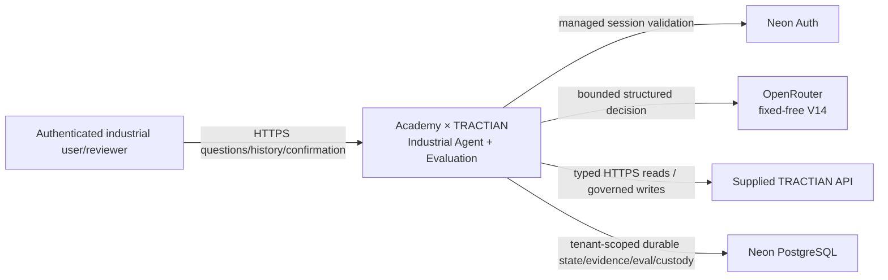
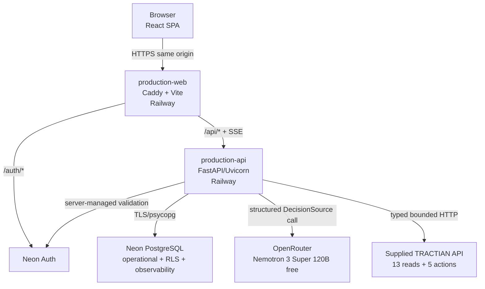
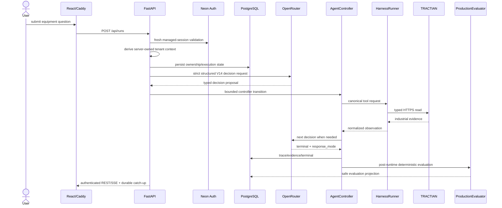
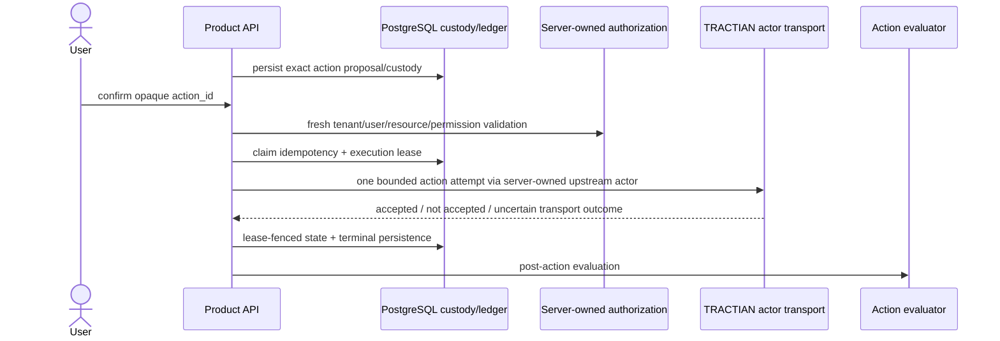

# Academy × TRACTIAN — Architecture

**Status:** ACTIVE canonical architecture  
**Last verified:** 2026-09-08 BRT  
**Hosted backend/runtime:** `5611687556b3d50c31f20fa85ede794f2500f05c`  
**Hosted frontend:** `4364364266c6a88d4affd85cb3a734c774cd42c8`  
**Hosted supplied API:** `47561c1175181b508139e23e6e39b555c1347d57`

This document describes the promoted architecture and its current runtime state. The OpenRouter V14 provider migration is deployed but not yet functionally accepted; the current B204 campaign fails at the first provider decision with a truncated completion before any TRACTIAN tool call.

## 1. System context



Browser input and model output are never authority for tenant, role, permissions, resource ownership, credentials, action identity, confirmation or idempotency.

## 2. Production containers



| Container | Responsibility | Current state |
|---|---|---|
| browser SPA | task-driven interaction + safe visualization | hosted at frontend `436436426...` |
| `production-web` | public HTTPS origin/static/proxy | Railway `SUCCESS` |
| `production-api` | auth, runtime, tools, actions, evaluation, REST/SSE | V14 composition `561168755...` |
| Neon Auth | managed session lifecycle | server-validated; fresh writes; bounded read coalescing |
| Neon PostgreSQL | durable operational truth + RLS + observability/evals/action custody | promoted production truth |
| OpenRouter | provisional model DecisionSource | pinned `nvidia/nemotron-3-super-120b-a12b:free`; V14 E2E currently failing |
| supplied TRACTIAN API | industrial evidence/action boundary | hosted; controlled governed-write smoke 5/5 |

## 3. Read/investigation flow



The current B204 V14 campaign stops at `Model-->>API`: the provider returns `finish_reason=length`, so V14 rejects the incomplete decision and never grants tool authority.

## 4. Provider decision layer

Serving semantics are layered:

```text
base Release 0 contract
→ V10 nested ID grounding + condition-evidence/stopping
→ V11 response_mode semantics
→ V12 human asset labels/comparisons/data quality
→ V13 initial identity grounding + duplicate-quality suppression
→ V14 fixed-free OpenRouter adapter, preserving V13 agent semantics
```

Current composition uses `build_release_provider_decision_source_factory_v14`.

### V14 exact provider contract

```text
provider_id = openrouter
model_id    = nvidia/nemotron-3-super-120b-a12b:free
route_id    = openrouter.chat_completions.v1.fixed_free
fallbacks   = disabled
cost        = USD0 hard gate
```

The request is non-streaming, single-choice, temperature 0, strict JSON Schema over the currently visible tools. The adapter performs no retry, output repair, credential lookup or provider-side tool execution.

A response is accepted only when the model identity is pinned, there is exactly one assistant choice, `finish_reason=stop`, no provider-side tool/function call is present, and nonempty decision content passes the existing V13 structured decision contract.

### Current failure localization

Sanitized probe:

```text
HTTP 200
served model = exact pin
assistant content present
finish_reason = length
```

The subsequent bounded 1024/default, 1024/minimized-reasoning and 4096/default comparison was blocked by HTTP 429 for all variants. No workaround is promoted.

## 5. Agent/tool authority boundary

```text
OpenRouter DecisionSource
→ typed proposal only
→ AgentController
→ bounded control flow
→ HarnessRunner
→ B1 schema/argument validation
→ B2 permission/resource/policy
→ B3 evidence/authorization requirements
→ ProductionTractianTransport
```

The model cannot perform network I/O or authorize itself.

### Non-progress invariant

Exact successful duplicate calls are suppressed by operation + normalized argument/resource fingerprint. Same tool with different arguments remains eligible for genuine progressive drill-down such as asset-level RMS followed by point-specific RMS.

## 6. Governed consequential-action flow



Required authority remains server-owned: grants, tenant/company scope, upstream action actor, credentials, kill switch, confirmation fingerprint and idempotency.

The controlled production pre-deploy smoke proved five executable governed action transports, all accepted with HTTP 200. This does not replace the pending full hosted action adversarial/security campaign.

## 7. Identity and tenant boundary

```text
managed HttpOnly session
→ server-side Neon validation
→ authenticated user + active organization
→ AuthenticatedRuntimeContext
→ transaction-local PostgreSQL organization scope
→ RLS
```

GET/HEAD may reuse a server-validated context for ≤2 s using a SHA-256 cookie digest and bounded singleflight cache. POST/non-read always receives fresh managed-session validation. Raw cookies are not cached; expired context is never served stale on error; invalid session is 401 and temporary auth dependency failure is 503.

RLS remains independent from model/provider behavior.

## 8. Persistence, realtime and evaluation

```text
canonical transition
→ sanitized immutable PostgreSQL event
→ authoritative (run_id, sequence) cursor
→ commit
→ LISTEN/NOTIFY wake-up
→ bounded durable catch-up
→ authenticated SSE
→ idempotent React projection
```

Rows/cursors are truth; NOTIFY is wake-up only. Raw secrets, grant material, private custody, evaluator-private gold and hidden reasoning are excluded from browser-safe projections.

Evaluation is post-runtime and deterministic where structural truth exists. The serving evaluator requires live model-call provenance when provider calls are enabled.

## 9. UX architecture

```text
Home
→ ask / progress / result
→ contextual evidence
→ Analyses: persisted history
→ Technical: trace / quality / data / system / actions / verification / studies
```

The frontend visualizes live server-owned architecture/runtime/evaluation state but owns no authorization or agent policy.

## 10. Hosted identity / release separation

Current hosted identities:

- backend `5611687556b3d50c31f20fa85ede794f2500f05c`;
- frontend `4364364266c6a88d4affd85cb3a734c774cd42c8`;
- supplied API `47561c1175181b508139e23e6e39b555c1347d57`.

The functional-closure PR is intentionally ahead of production. A source/docs commit is not a production promotion. Final acceptance requires exact accepted candidate SHA == deployed production SHA.

## 11. Technology decisions

| Area | State |
|---|---|
| custom `AgentController` | promoted baseline |
| typed `HarnessRunner` / ToolSpec | hard execution boundary |
| FastAPI/Pydantic | promoted |
| PostgreSQL + RLS | promoted production truth |
| LISTEN/NOTIFY + durable cursor | promoted wake-up/realtime design |
| React/TypeScript/TanStack Query/React Flow/ECharts | promoted UX/visualization stack |
| Railway + Neon | hosted production |
| OpenRouter V14 | provisional serving provider; functional gate currently FAIL |
| DuckDB | dev/benchmark compatibility only |
| LangGraph migration | `NO_CHANGE` |
| multi-agent | `NO_CHANGE` |
| RAG/vector DB/persistent memory | `NO_CHANGE` |
| MCP | `NO_CHANGE` absent measured interoperability gap |
| Redis/Kafka/Kubernetes | `NO_CHANGE` absent measured need |
| adaptive stopping/routing | challenger only after quantitative win |

The present blocker is provider completion/availability, not evidence for a topology rewrite.

## 12. Current non-claims

Do not claim:

- OpenRouter V14 functional acceptance while B204 is 0/3;
- that the V14 campaign reached TRACTIAN reads;
- final provider superiority/selection;
- broad 13-read live coverage;
- final end-user/action SECURITY-V1 completion;
- distributed exactly-once external side effects;
- evidence-derived production capacity/SLO/HA/RTO/RPO;
- human semantic calibration or measured operational time savings;
- branch-protection enforcement while GitHub reports `main.protected=false`;
- any new orchestration/framework superiority without a controlled challenger win.

See [`progress/2026-09-08-openrouter-v14-governed-actions-functional-acceptance.md`](progress/2026-09-08-openrouter-v14-governed-actions-functional-acceptance.md) for the exact current evidence.