# Presentation Architecture Overlays

These diagrams simplify [`../ARCHITECTURE.md`](../ARCHITECTURE.md). They are presentation assets, not independent architecture truth.

## 1. Runtime boundary overview

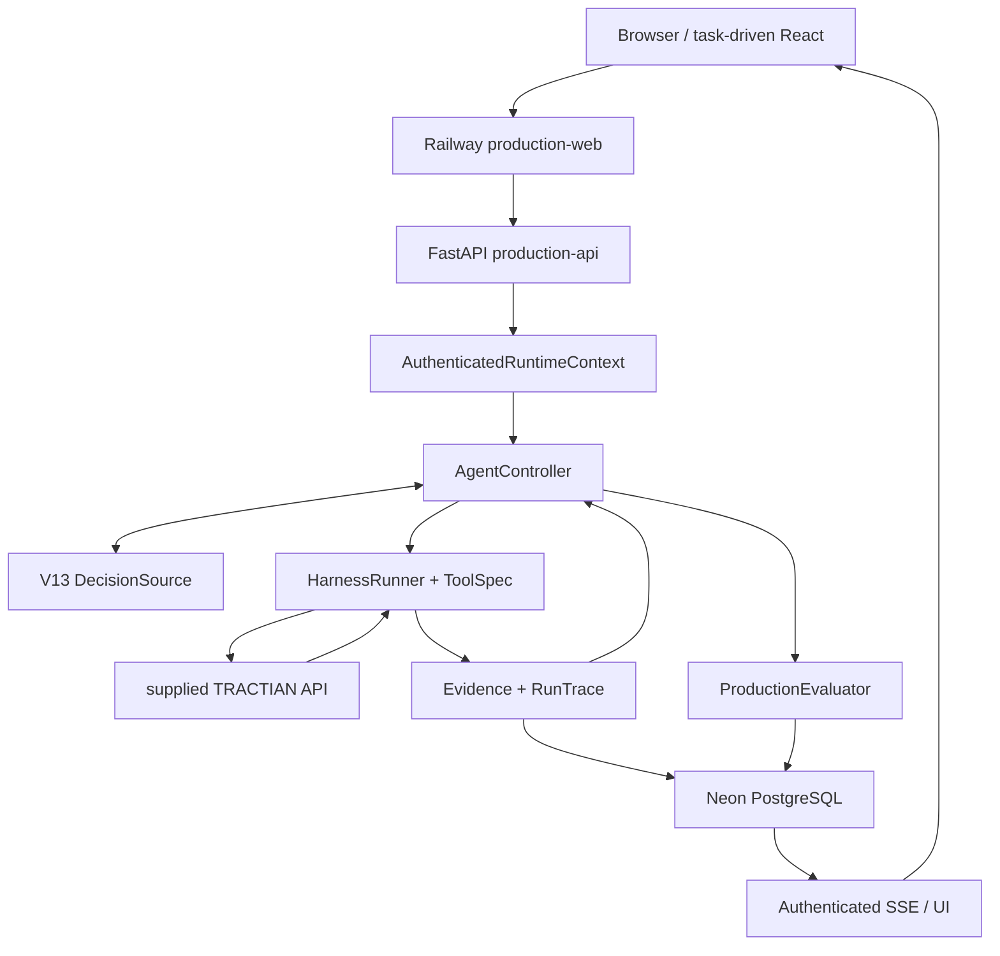

Key line: model proposes; deterministic runtime owns authority/execution.

## 2. Identity / session / tenant overlay

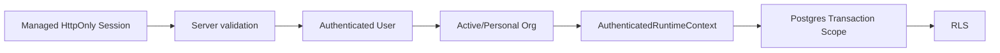

Resilience inset:

```text
GET/HEAD → SHA256(cookie) → ≤2s validated cache → singleflight
POST/non-read → fresh validation
expired cache → never stale-on-error
401 invalid ≠ 503 unavailable
```

## 3. V13 explicit-asset grounding

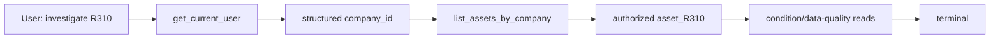

Missing label path:

```text
label absent from authorized fleet
→ no cross-scope expansion
→ no request for hidden asset_id
→ bounded unavailable terminal
```

## 4. Canonical tool execution

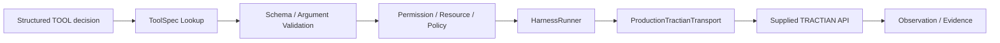

## 5. Progressive technical drill-down

```mermaid
flowchart LR
    A[get_spectrum(asset_R310)]
    P[structured point_id observed]
    S[get_spectrum(asset_R310, point_id)]
    E[more specific evidence]

    A --> P --> S --> E
```

Key line: same tool name does not imply duplicate; compare arguments/resource/evidence contribution.

## 6. Evidence / trace lineage

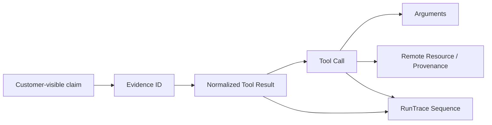

Audit external observable artifacts, not hidden chain-of-thought.

## 7. Terminal + response-mode overlay

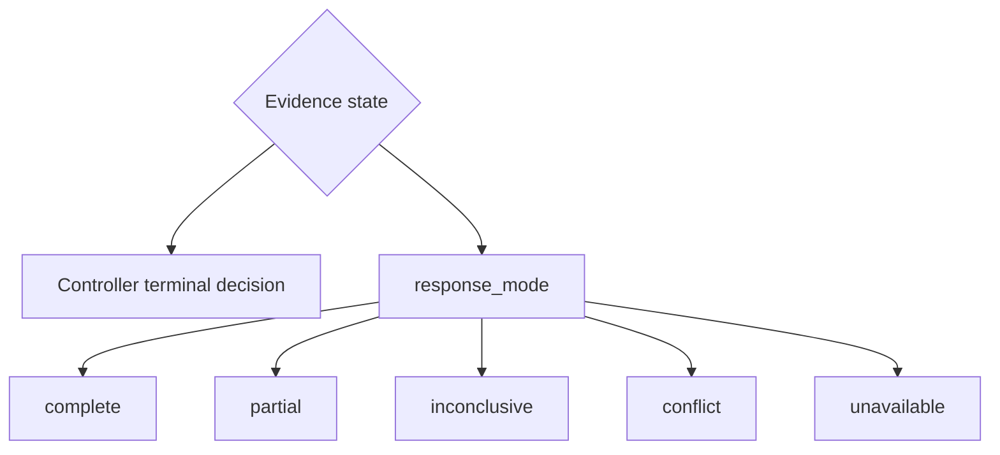

Key line: terminal controls runtime outcome; response mode describes epistemic support. Neither grants authorization.

## 8. Evaluator isolation

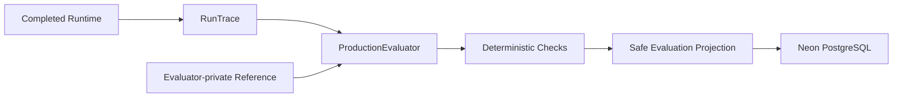

Draw no arrow from evaluator-private reference to runtime/model.

## 9. Consequential action boundary

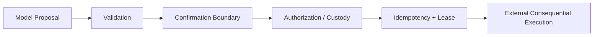

Overlay on X:

```text
RELEASE 0
DISABLED / DENY-ALL
```

## 10. Production deployment

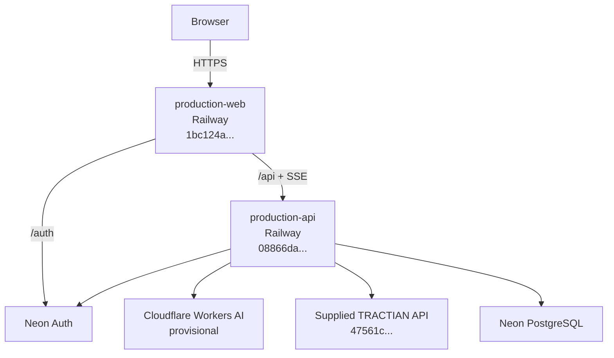

## 11. Durable realtime

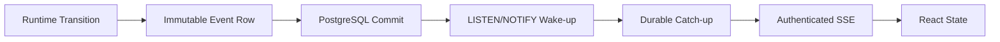

PostgreSQL rows/cursors are authoritative; notification only reduces latency.

## 12. Current task-driven UI

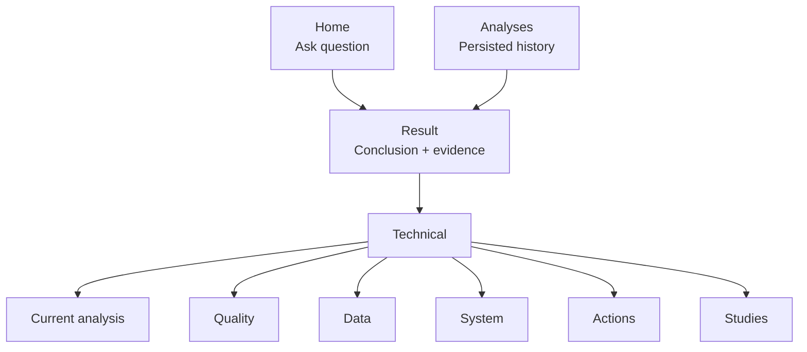

## 13. Final recap

```text
1  Server-validated identity / tenant
2  Durable run ownership
3  V13 grounding + AgentController
4  ToolSpec deterministic validation
5  HarnessRunner + remote TRACTIAN I/O
6  Evidence + RunTrace
7  Terminal + response_mode semantics
8  Post-runtime ProductionEvaluator
9  PostgreSQL + authenticated SSE + task-driven UI
```

End on this complete causal path.