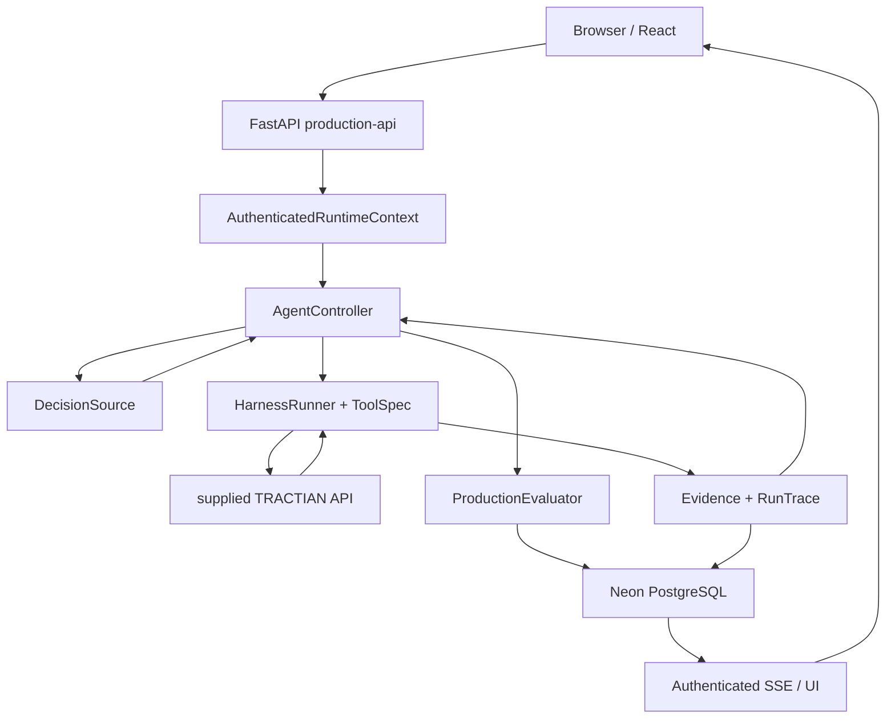
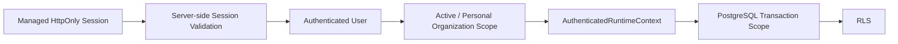
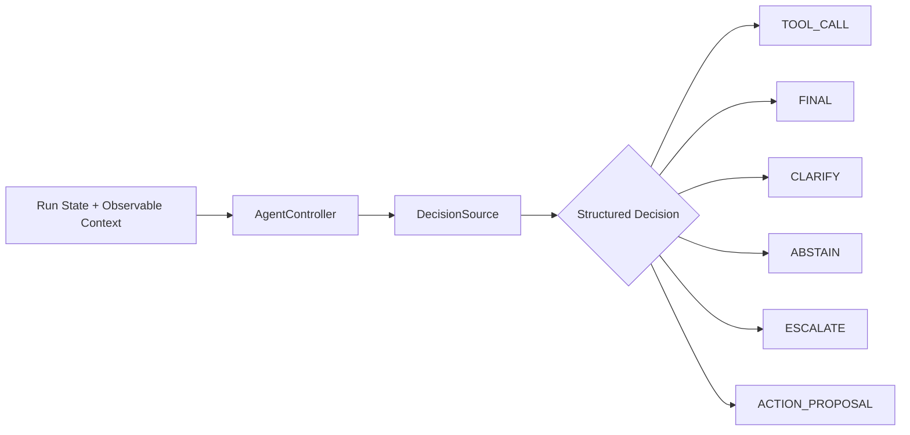
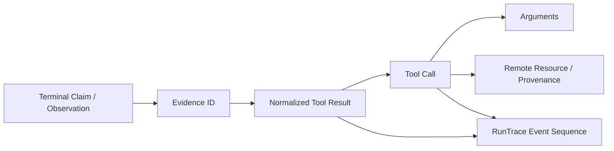
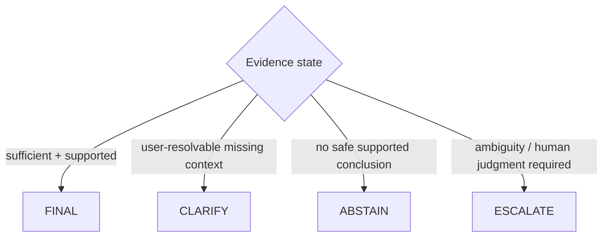
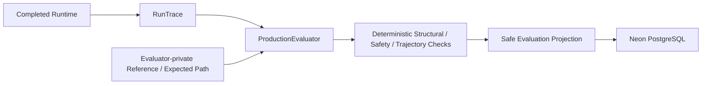
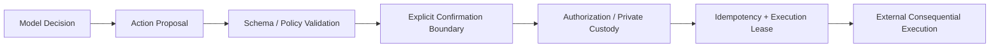
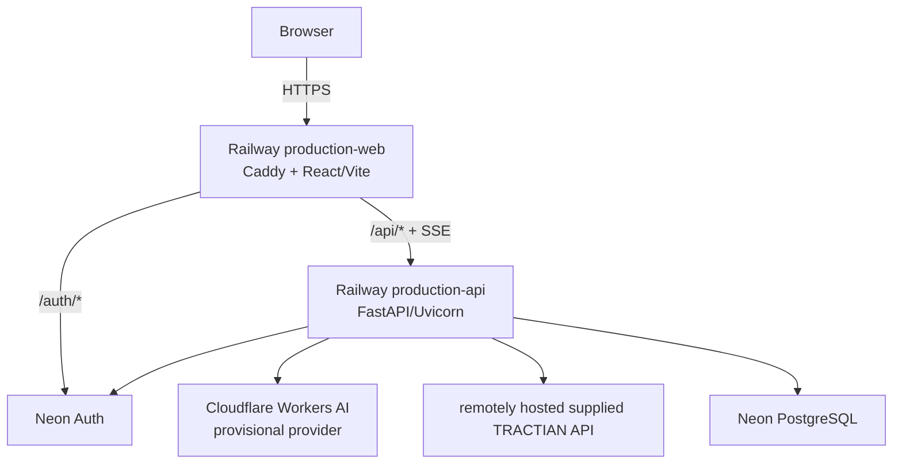
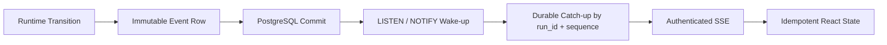

# Presentation Architecture Overlays

These diagrams are intentionally simpler than [`../ARCHITECTURE.md`](../ARCHITECTURE.md). They are presentation assets, not independent architecture truth.

Use them as overlays while the live product runs. Highlight only the active path.

---

## 1. Runtime boundary overview



### Highlight sequence

1. `Browser → FastAPI → AuthenticatedRuntimeContext`
2. `AgentController ↔ DecisionSource`
3. `AgentController → HarnessRunner → TRACTIAN`
4. `TRACTIAN → Evidence/RunTrace`
5. `RunTrace → ProductionEvaluator → PostgreSQL`
6. `PostgreSQL → SSE → Browser`

---

## 2. Identity / tenant authority overlay



### Presenter labels

- Browser-supplied tenant/role/permission values are not authority.
- Invalid or mismatched session fails closed.
- Runtime permissions are server-defined.
- RLS is independent of the LLM.

---

## 3. Agent control-flow overlay



### Key line

`DecisionSource` proposes; `AgentController` owns the bounded loop.

---

## 4. Canonical tool execution overlay

```mermaid
flowchart LR
    D[Structured TOOL_CALL]
    TS[Canonical ToolSpec Lookup]
    B1[B1 Schema / Argument Validation]
    B2[B2 Permission / Resource / Policy]
    HR[HarnessRunner]
    PT[ProductionTractianTransport]
    HTTP[Typed HTTPS]
    API[supplied TRACTIAN API]
    OBS[Normalized Observation / Evidence]

    D --> TS --> B1 --> B2 --> HR --> PT --> HTTP --> API --> OBS
```



### Key lines

- The model does not directly perform network I/O.
- Tool name, arguments, validation and transport are separately observable.
- Release 0 capability contract: `13 READ live + 5 ACTION proposal-only`.

---

## 5. Evidence / trace lineage overlay



### Key line

Audit observable execution artifacts, not hidden chain-of-thought.

---

## 6. Terminal policy overlay



### Key line

Degraded evidence changes terminal behavior instead of forcing a fabricated answer.

---

## 7. Evaluator isolation overlay



### Important visual rule

Draw **no arrow from evaluator-private reference to runtime/model**.

### Key line

The agent cannot optimize against private gold during the run.

---

## 8. Expected vs observed overlay

```text
EXPECTED TRAJECTORY          OBSERVED RUN
───────────────────          ────────────
Tool A                       Tool A        ✓
Tool B                       Tool B        ✓
Tool C                       Tool C        ✓ / ✗
Expected evidence            Evidence      metric
Expected terminal            Terminal      ✓ / ✗
Action/escalation            Decision      ✓ / ✗
```

Show only fields that are actually evidenced for the selected run.

---

## 9. Consequential action boundary overlay



Overlay label on `X`:

```text
RELEASE 0
DISABLED / DENY-ALL
```

### Key line

Proposal visibility is not execution authority.

---

## 10. Production deployment overlay



### Key lines

- Same demonstrated product is remotely hosted.
- Provider is provisional, not a final tournament winner.
- Supplied API is project-hosted remote integration, not TRACTIAN corporate production infrastructure.

---

## 11. Durable realtime overlay



### Key line

PostgreSQL rows/cursors are authoritative; notifications only reduce polling/latency.

---

## 12. Final 9-step recap

Use this as the last frame:

```text
1  Session validation / tenant context
2  Durable run ownership
3  AgentController + DecisionSource
4  Canonical ToolSpec validation
5  HarnessRunner + remote TRACTIAN HTTPS
6  Evidence + RunTrace
7  Explicit terminal policy
8  Post-runtime ProductionEvaluator
9  PostgreSQL projection + authenticated SSE
```

Do not add another architecture layer after this. End on the complete causal path.